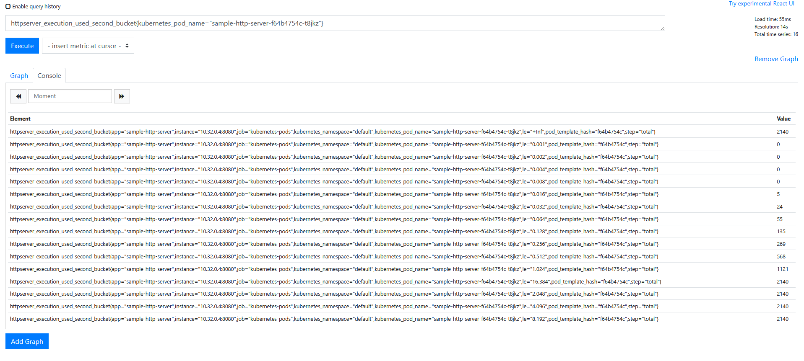
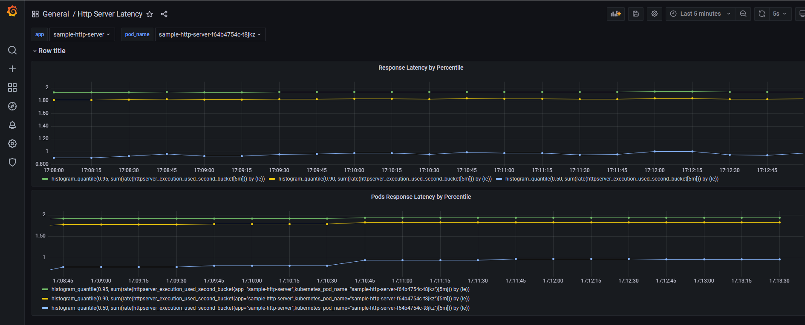

# sample http server

## week ten
### question
+ 为 HTTPServer 添加 0-2 秒的随机延时
+ 为 HTTPServer 项目添加延时 Metric
+ 将 HTTPServer 部署至测试集群，并完成 Prometheus 配置
+ 从 Prometheus 界面中查询延时指标数据
+ 创建一个 Grafana Dashboard 展现延时分配情况

### answer
+ metrics:pkg/metrics
+ prometheus-ingress:k8smanifests/loki-grafana-ingress.yaml
+ grafana-ingress:k8smanifests/loki-grafana-ingress.yaml
+ prometheus :
 


+ grafana:



### note
+ ingress set hostnetwork
  + node add ingerss label

  ```bash
  $ kubectl label node xiang-nuc app=ingress
  node/xiang-nuc labeled
  ```
  + set ingress controller yaml

  ```yaml
  # Source: ingress-nginx/templates/controller-deployment.yaml
  apiVersion: apps/v1
  kind: DaemonSet
  metadata:
    labels:
      ...
    name: ingress-nginx-controller
    namespace: ingress-nginx
    template:
      metadata:
        labels:
          app.kubernetes.io/name: ingress-nginx
          app.kubernetes.io/instance: ingress-nginx
          app.kubernetes.io/component: controller
      spec:
        dnsPolicy: ClusterFirst
        containers:
          ...
        hostNetwork: true
        nodeSelector:
          app: ingress
          kubernetes.io/os: linux
  ```
  + test

  ```bash
  $ curl https://172.16.1.199/aaa -H "host:test.httpserver.local" -k
  hello aaa
  ```

+ test metrics

```bash
# 发送请求
$ while true ;do curl https://172.16.1.199/aaa -H "host:test.httpserver.local" -k & done
# 查看结果
$  watch -n 1 'curl https://172.16.1.199/metrics -H "host:test.httpserver.local" -k |grep httpserver_execution_used_second_bucket'
```
+ set prometheus ingress and grafana ingress

```bash
$ k apply -f  k8smanifests/loki-prometheus-ingress.yaml
$ k apply -f  k8smanifests/loki-grafana-ingress.yaml
```
+ windows set hosts to connect vm

```
c:\windows\system32\drivers\etc\hosts
172.16.1.199 test.httpserver.local
172.16.1.199 test.prometheus.local
172.16.1.199 test.grafana.local
```